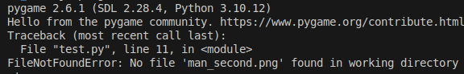
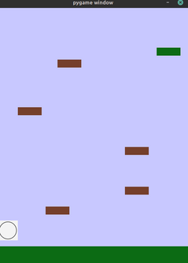
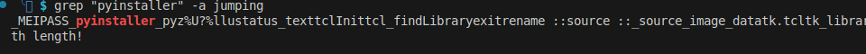

Running the binary, we're presented with an error:



This indicates two things:
1. We're supposed to have a PNG file in the same directory called "man_second.png".
2. From the first two printed messages, we see this was made with [pygame](https://www.pygame.org/).

We can place whatever image we want in the current directory and call it `man_second.png` (and resize to the appropriate dimensions so the game doesn't look wack :P), and when rerunning the executable we have a platformer game where it seems we have to reach a green platform!



There seems to be a particular difficult jump from the fourth highest to the third highest platform.

At this point we could try use some debugger to figure out how our position is set and manually set it, or potentially do this legitimately by making use of the weird acceleration physics in this game (I'm genuinely not sure if this is possible haha), but one way is just to decompile the program.

We know this game was likely coded in Python, since it's a pygame-made game, however Python is an interpreted language, which means you run Python programs by interpreting the *source code*, not an executable as we've been given.

This means the source code must have been compiled with some special tool. We can find a few by looking them up online, and if we look for particular signatures pertaining to each of these Python compilers, we can deduce this game was compiled with `pyinstaller`:



Looking into this online, it seems [pyinstractor](https://github.com/extremecoders-re/pyinstxtractor) allows us to extract the `pyinstaller`-generated binary into the resultant `.pyc` files. The directory is a bit of a mess, and it's not immediately obvious which file contains the main logic of the game, but `grep`ping for the `man_second.png` string shows an occurrence in the `test.pyc` file (it turns out this is where the code is). We can use `./pydas` from [pycdc](https://github.com/zrax/pycdc) to get a disassembly of the bytecode; at the end is this section of disassembly:

```
        1276    LOAD_CONST                      40: (69, 83, 248, 247, 201, 230, 244, 121, 219, 149, 77, 175, 159, 11, 129, 102, 49, 30, 62, 228, 158, 79, 255, 208, 124, 102, 127, 119, 154, 15, 145, 121, 140, 229, 51, 221, 77, 72, 73, 28, 30, 78, 225, 229, 172, 57, 45, 65, 252, 48)
        1278    LIST_EXTEND                     1
        1280    LOAD_CONST                      41: b'\x0eb\xcf\x8c\xf8\xb9\xc0:\xec\xe0y\xe3\xd3r\xde"\x01P\t\xbb\xd5!\xcf\xa7#W9(\xadg\xa5N\xd3\xafF\x90=\x17x)A>\xd1\xd0\x99\x08o-\xb9M'
        1282    CALL_FUNCTION                   2
        1284    GET_ITER                        
        1286    CALL_FUNCTION                   1
        1288    CALL_FUNCTION                   1
        1290    LOAD_METHOD                     71: decode
        1292    CALL_METHOD                     0
        1294    STORE_NAME                      72: somemoretext
        1296    LOAD_NAME                       32: display_message
        1298    LOAD_CONST                      42: 'You win!'
        1302    POP_TOP                         
        1304    LOAD_NAME                       32: display_message
        1306    LOAD_NAME                       72: somemoretext
        1308    LOAD_CONST                      43: 2
```

We can vaguely deduce that:
- We're loading some list of numbers (notably, all less than `256`) as well as a byte string
- We perform some function and iteration on the two arguments...?
- Decode is called
- The result is stored in `somemoretext`
- `display_message` is called on "You win!" and then `somemoretext`

This indicates that this is likely the logic for printing the final message after the game is won. We can try reading the disassembly a bit more to figure out what operation is performed between the list and bytestring, but an obvious guess is that it's a stream XOR, and indeed, this will give us the flag!

```py
byte_list = (69, 83, 248, 247, 201, 230, 244, 121, 219, 149, 77, 175, 159, 11, 129, 102, 49, 30, 62, 228, 158, 79, 255, 208, 124, 102, 127, 119, 154, 15, 145, 121, 140, 229, 51, 221, 77, 72, 73, 28, 30, 78, 225, 229, 172, 57, 45, 65, 252, 48)
>>> byte_string = b'\x0eb\xcf\x8c\xf8\xb9\xc0:\xec\xe0y\xe3\xd3r\xde"\x01P\t\xbb\xd5!\xcf\xa7#W9(\xadg\xa5N\xd3\xafF\x90=\x17x)A>\xd1\xd0\x99\x08o-\xb9M'
somemoretext_list = []
for c1, c2 in zip(byte_list, byte_string):
    somemoretext_list.append(c1 ^ c2)

    
print("".join(map(chr, somemoretext_list)))
```

Flag: 
`K17{1_4C7u4LLy_D0N7_Kn0w_1F_7h47_JuMp_15_p0551BlE}`